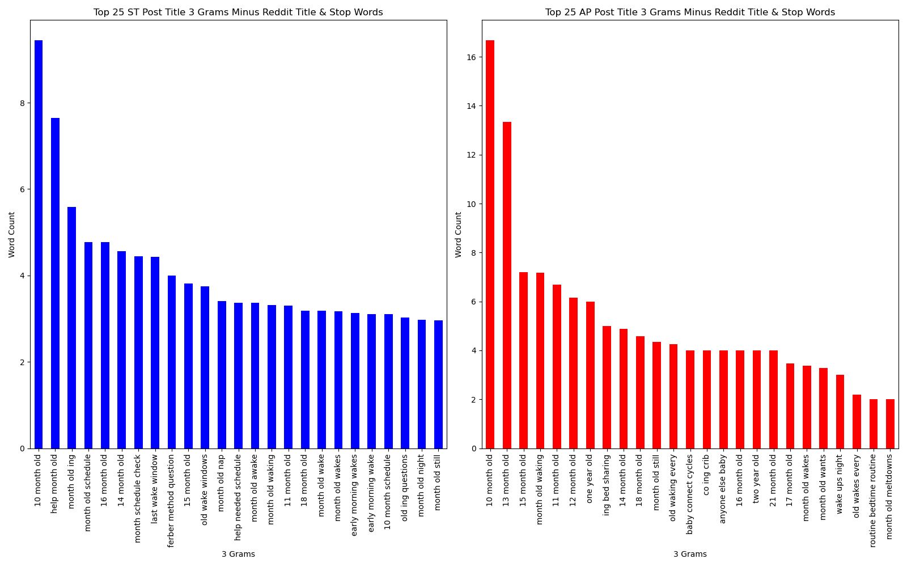

#  Project 3: Classification of Attachment Parenting and Sleep Training Subreddits

---

## Table of Contents

- [Problem Statement](#Problem-Statement)
- [Executive Summary](#Executive-Summary)
- [Introduction](#Introduction)
- [Data Dictionary](#Data-Dictionary)
- [Analytical Summary](#Analytical-Summary)
- [Analysis and Findings](#Analysis-and-Findings)
- [Exploratory Data Analysis of Subreddit Text (Notebook)](Notebooks/02_eda_and_data_cleaning.ipynb)
- [Natural Language Processing Model and Evaluation (Notebook)](Notebooks/03_model_optimization_and_evaluation.ipynb)
- [Conclusion and Recommendations](#Conclusion-and-Recommendations)
- [Works Cited](#Works-Cited)

---

## Problem Statement

Therapists of Data is a data brokerage company that has recently been hired by the baby monitor company Owlette to help them identify individuals within target markets to advertise their baby monitoring equipment. Owlette aims to target individuals who subscribe to classic sleep training philosophies to yield the highest return of investment (ROI) on their advertising budget([*source*](https://www.theguardian.com/lifeandstyle/2016/jul/30/attachment-parenting-best-way-raise-child-or-maternal-masochism)). Those that subscribe to the attachment parenting philosophy generally sleep with their children and, therefore, have less need for the range of monitoring equipment from audio/video monitoring to vital sign monitoring offered by Owelete. Whereas those in the Sleep Training camp begin sleeping apart from their children in their early weeks of their infants life and would benefit from their products. Therapists of Data will create an hyperparameter optimized stacking classification model consisting of TfidVectorized text from post titles in the Sleep Training and Attachment Parenting Subrredits modeled with Random Forest Classifier, MultinomialNB and AdaBoost with Decision Tree base estimator as level 1 estimators and Logistic Regression as the final estimator. The stacked model will categorize individuals as "sleep trainers" or "attachment parents" based on their post title patterns. Once the stacked model has been created it will be applied to other social media platforms to predict if individuals are a good target for baby monitor advertising. Creating a model that correctly identifies sleep training individuals based on key words, phrases and language will allow Therapists of Data to sell the data collected from social media sites to Owlete who will then better target individuals that are interested in their products.

---

## Executive Summary

Owlet's baby monitoring technology is on the most sophisticated on the market. The ease of use, the features, the safety and peace of mind it can offer a family are unparalleled!

As you know, there are a growing number of parents out there that are not only wanting but are needing the equipment that you are offering in order to sleep at night knowing there babies and toddlers are sound asleep. We need to reach your target market efficiently so that every advertising dollar spent is working for you.

We have developed a model that will read through social media posts and find the customers that you want to reach! It not only reaches individuals that are in the market for equipment and already aligned with what Owlet offers but also those that are on the fence about purchasing monitoring equipment and just need that extra push.

With this model we expect to reach customers who do not even know they are in the market for a monitor. 

Our model has been created and confirmed on Reddit and is ready to be applied to Facebook, Instagram, TikTok and Twitter.

We have the model in hand and are simply waiting for you! Let us help you reach your customers that need your technology today.

___

## Introduction

Raising children in the age of information can be challenging. Parents are bombarded with polarizing information that can vary from what a child should eat to what toys might contain chemicals that children should avoid. Although much of the information flooding the internet is anecdotal at best and not rooted in sound scientific research. However, many parents feel compelled to pick sides and can be compelled to make decisions based on information that is less than credible, especially when it comes to a child's sleep and preserving their own relationships (and sanity)([*source*](https://www.theguardian.com/lifeandstyle/2016/jul/30/attachment-parenting-best-way-raise-child-or-maternal-masochism)) ([*source*](https://www.theguardian.com/lifeandstyle/2016/may/29/dr-dillner-can-sleep-training-help-parents-and-children))([*source*](https://www.nytimes.com/2020/04/17/parenting/sleep-training-marriage.html)). Currently, there are two major philosophies in how to correctly allow infants and toddlers to sleep. The first are sleep training, in which the child sleeps alone in their own room and allowed to "cry it out" when upset([*source*](https://www.nytimes.com/2018/04/18/magazine/harvey-karp-baby-mogul.html)). The second is attachment parenting, which is a larger philosophy on child rearing but includes bed sharing that is often considered the alternative to sleep training, where the child co-sleeps with the parents or a parent([*source*](https://www.nytimes.com/2005/12/29/fashion/thursdaystyles/and-baby-makes-three-in-one-bed.html)). 

Sleep training involves a series of steps that instruct the parents to leave the child to learn self soothing techniques on their own. This has also been called the "cry it out" technique([*source*](https://www.happiestbaby.com/blogs/baby/avoid-crying-it-out-sleep-training)). In contrast, attachment parenting does not subscribe to "cry it out" but rather insists that method prevents the child from developing "secure attachment" with the parents and can affect the child's ability to develop relationships later in life([*source*](https://currypsychology.com/press-media/today-what-is-attachment-theory-from-breastfeeding-to-co-sleeping-heres-what-parents-should-know-about-the-attachment-parenting-theory/)). Although both philosophies claim to have the child's best interest in mind they argue that the other's techniques can be detrimental to early development and both are highly targeted on sleeping practices.([*source*](https://www.doctorpedia.com/channels/cry-it-out-or-co-sleeping-what-does-science-say-about-infant-sleep-training/))

Attachment parenting focuses on "secure attachment", an idea that a child needs to feel supported by the parent at all times in all situations. Attachment parenting advocates argue that this is especially important at night prior to and during the child's sleep time. The argument is that when a child is left alone they may experience feelings of anxiety and abandonment which can alter their emotional development which can have lasting effects well into adulthood. Therefore, a majority of parents will co-sleep with their children eliminating the need for most monitoring equipment as the child is seldom, if ever, left alone([*source*](https://currypsychology.com/press-media/today-what-is-attachment-theory-from-breastfeeding-to-co-sleeping-heres-what-parents-should-know-about-the-attachment-parenting-theory/)). Conversely, sleep training argues that self soothing techniques are critical to lifelong success and establish self confidence, a sense of self and independence in a child that is carried into adulthood. Sleep training parents will often leave there child alone during naps and at night and utilize an array of monitoring equipment that is commercially available([*source*](https://www.happiestbaby.com/blogs/baby/avoid-crying-it-out-sleep-training)). 

The baby monitoring company Owlet has developed a line of monitoring equipment that allows not only for audio/visual monitoring but also a wide range of extra features. Owlet monitoring equipment can relay blood O2 levels, heart rate and sleep and wake times directly to the paired Owlet app. It also offers two way communication to facilitate sleep training protocols. Naturally, sleep training parents are a marketing target for Owlet and creating a model to identify potential customers is a priority for the company and the purpose of this project.
___

## Data Dictionary

|Feature|Type|Dataset|Description|
|---|---|---|---|
|**subreddit**|object, categorical|sleep_data|Category of Subreddit.|
|**selftext**|object|sleep_data|Text of Subreddit post.|
|**title**|object|sleep_data|Title of Subreddit post.|
|**created_utc**|float|sleep_data|Date and time post was created in UTC.|
|---|---|---|---|
|**subreddit**|object, categorical|sleep_data_2|Category of Subreddit.|
|**selftext**|object|sleep_data_2|Text of Subreddit post.|
|**title**|object|sleep_data_2|Title of Subreddit post.|
|**created_utc**|float|sleep_data_2|Date and time post was created in UTC.|
|---|---|---|---|
|**subreddit**|object, categorical|subreddit_data|Category of Subreddit.|
|**selftext**|object|subreddit_data|Text of Subreddit post.|
|**title**|object|subreddit_data|Title of Subreddit post.|
|**created_utc**|float|subreddit_data|Date and time post was created in UTC.|
___

## Analytical Summary

The objective of this project was to construct a model to accurately categorize the Subreddit origin based on title words of a Subreddit post. This was accomplished by methodical data analysis, model iteration and testing. The end result is a stacked model with superior predictive power when compared to the null model that can be used to predict if an individual subscribes to the attachment parenting philosophy or sleep training philosophy based on text from their social media posts. This can in turn be used for marketing purposes to target individuals that would be good potential customers for baby monitoring equipment. It is worth mentioning that only the title post words were used in modeling.
___

### Analysis and Findings

Post text and post titles for the Subreddits Attachment Parenting (AP) and Sleep Training (ST) were scraped from Reddit using the Praw method ([*source*](https://praw.readthedocs.io/en/stable/)). Once the data had been scraped and compiled into a dataframe it was subjected to rigorous EDA and preprocessing. The EDA allowed for determining which methods to use for modeling and the preprocessing was a vital step to creating an accurate model.

In order to create a model that could function outside of the Subreddit space all words from the Subreddit title were removed from the dataset. Only the title of the individual posts from subreddit dataframe were used in the modeling process. Columns that included title length, title word count and average word count per post were created. The histograms for each were plotted but showed little difference between AP and ST and were not used for modeling. TfidVectorizer was used to vectorized the post title words for titles in both AP and ST Subreddit categories. The top 25 words used in each category were also calculated. Stop words, words such as to, for, do, with, etc., were common between both categories top words, 17 shared in all. 
 
 

*Figure 1.Bar Chart of Top 25 Words for ST and AP With Stop Words*
 
 

Given that the Subreddit title words were common between both categories they were dropped from the data set using TfidVectorizer. After removing stop words only 11 of the top 25 most common words in both categories were shared.
 
 

*Figure 2.Bar Chart of Top 25 Words for ST and AP Without Stop Words*
 
 

Of the top 25 words shared between both categories, words such as nap and naps both appeared. TfidVectorizer was used to lemmatize the words in an effort to reduce the number of words shared between the categories. Lemmatization, unfortunately, increased the number of shared words between the categories to 12 and introduced a number of special characters into the top 25 words for both categories. 
 
 

*Figure 3.Bar Chart of Top 25 Words for ST and AP Lemmatized*
 
 

TfidVectorizer was used again to generate 2 grams to reduce the number of common words between the 2 categories. This reduced the number of shared words from 11 to 7 suggesting  more of a difference for a model to utilize to categorize correctly.
 
 

*Figure 4.Bar Chart of Top 25 Words for ST and AP with 2 grams*
 
 

Lastly, TfidVectorizer was used to generate 3 grams with the assumption that if 2 grams reduced the number of shared words between categories then 3 grams would lead to further reduction. However, 3 grams increased the number of common words to 9.
 
 

*Figure 4.Bar Chart of Top 25 Words for ST and AP with 3 grams*
 
 
Additionally, CountVectorizer was used as TfidVectorizer was above to identify any differences or better performance. However, although CountVectorizer did yield higher word counts than TfidVectorizer, the common words between categories were consistently higher (data not shown).

Once the EDA had been concluded, base models were run to ascertain what models should be included in hyperparameter optimization and the final stacked model. MultinomialNB, random forest classifier, KNN, adaboost with decision tree classifier as the base estimator and adaboost with logistic regression as the base estimator were scored for both TfidVectorizer (tvec) and CountVectorizer (cvec) with and without stop words. The results were surprising. Tvec scored higher than cvec in all instances and both cvec and tvec scored higher withstop words than without. Based on the EDA this is counterintuitive as removing the stop words reduced the commonality of the categories. I am not sure how to explain that at this time. Tvec paired with the random forest model scored the highest of all

Tvec and cvec were also used to create 2 grams and 3 grams with the random forest base model. the 2 grams scored better than 3 grams but both scores were relatively low. Given that 2 grams had reduced the common words between the categories I suspected it would have performed better. Tvec and random forest were still the best performing model. Lastly, for the base models, tvec and cvec were used to lemmatize the title text and both were used along with the random forest classifier. The tvec lemmatized with random forest scored just below tvec  with the random forest classifier with cvec scoring even lower. 

Gridsearch was then used to optimize hyperparameters for the top performing models: tvec with multinomialNB, tvec with random forest and tvec with adaboost and decision tree classifier as the base estimator. Almost all of the models scored best with the default hyperparameters except for tvec which had optimized hyperparameters for maximum features at 6,000 and maximum df of 0.65. The three models were then stacked in various order with the final estimator Logistic Regression. The best performing stacked model consisted of random forest classifier first, multinomialNB second and Adaboost classifier third, each paired with tvec.

The stacked model score is summarized in the table below.
|  | | 
| --- | --- | 
| Train Score    | 0.9953114534494307| 
| Test Score   | 0.9016064257028112 |  

*Table 1.Stacked Model Train and Test Score*
 
 

In line with the Accuracy scores above the model did have Type 1 and Type 2 errors. These are summarized in the confusion matrix below.

*Figure 5.Confusion Matrix of Test Score for Stacked Model*
 
 
From the matrix there were 58 type 2 errors and 40 type 1 errors. In this instance it would be best to have higher accuracy and less type 2 errors as these are all potential customers that are missed. Although the model performs well overall it would be best to optimize for accuracy or error on the side of type 1 errors as the topic words may indicate for these individuals that they may be able to be swayed to buying monitoring equipment. The table below summarized the metrics for the model.
 
 

|  | | 
| --- | --- | 
| Accuracy    | 0.90| 
| Specificity   | 0.92 |
| Sensitivity    | 0.88| 
| Precision   | 0.92 |
| F1 Score   | 0.90|

*Table 2.Model Analysis Values*
 
 

As mentioned previously, it would be best to have high accuracy but that aside optimizing for sensitivity over specificity would be ideal. It would be better to direct adds towards potential customers that may be on the fence about sleep training than it would be to miss customers that are already thinking of buying equipment. 

## Conclusion and Recommendations

The stacked model produced in this project is an effective method to utilize text from social media posts to identify marketing leads with low risk optimizing ROI for advertising. Given that in reality individuals are not as polarized as these categories suggest, the mis-classified posts could very well be individuals who have a foot in each camp and may be very likely to buy monitoring equipment. Given that the model has the accuracy score that it does in light of the amount of overlap in text from the two Sureddit categories I would recommend going live with the model and sing it on other social media sites to begin to attract new customers.

## Works Cited

"r/Sleeptrain." Reddit, https://www.reddit.com/r/sleeptrain/top/?t=month Accessed 14 January 2023

"r/Attachment Parenting." Reddit, https://www.reddit.com/r/AttachmentParenting/?f=flair_name%3A%22%E2%9D%A4%20Sleep%20%E2%9D%A4%22 Accessed 14 January 2023

"Attachment parenting: the best way to raise a child – or maternal masochism?" The Guardian, https://www.theguardian.com/lifeandstyle/2016/jul/30/attachment-parenting-best-way-raise-child-or-maternal-masochism Accessed 19 January 2023

"Should I sleep-train my child?" The Guardian, https://www.theguardian.com/lifeandstyle/2016/may/29/dr-dillner-can-sleep-training-help-parents-and-children Accessed 19 January 2023

"Sleep Training My Child Almost Put My Marriage to Bed" The New York Times, https://www.nytimes.com/2020/04/17/parenting/sleep-training-marriage.html Accessed 19 January 2023

"And Baby Makes Three in One Bed" The New York Times, https://www.nytimes.com/2005/12/29/fashion/thursdaystyles/and-baby-makes-three-in-one-bed.html Accessed 19 January 2023

"How Harvey Karp Turned Baby Sleep Into Big Business" The New York Times, https://www.nytimes.com/2018/04/18/magazine/harvey-karp-baby-mogul.html Accessed 19 January 2023

"Baby Won’t Sleep Through the Night? You’re Not Alone" The New York Times, https://www.nytimes.com/2018/11/19/well/family/baby-wont-sleep-through-the-night-youre-not-alone.html Accessed 19 January 2023

"What is Attachment Theory?" Curry Psychology Group, https://currypsychology.com/press-media/today-what-is-attachment-theory-from-breastfeeding-to-co-sleeping-heres-what-parents-should-know-about-the-attachment-parenting-theory/ Accessed 19 January 2023

"Baby Sleep Training: What's the "Cry it Out" Method?" Happiest Baby, https://www.happiestbaby.com/blogs/baby/avoid-crying-it-out-sleep-training Accessed 19 January 2023

"Cry It Out or Co-Sleeping – What Does Science Say About Infant Sleep Training?" Doctorpedia,
https://www.doctorpedia.com/channels/cry-it-out-or-co-sleeping-what-does-science-say-about-infant-sleep-training/ Accessed 19 January 2023
